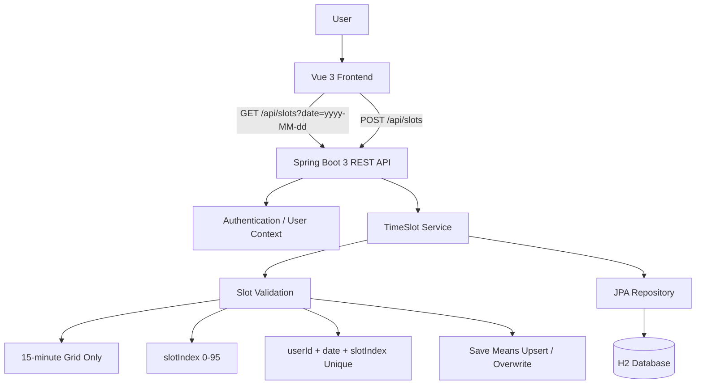
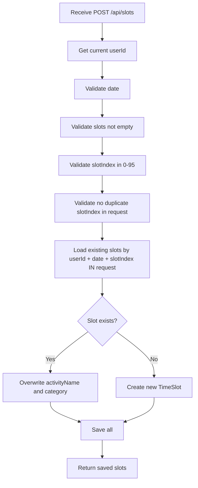

# Interval 系统设计文档

## 1. 项目概述

Interval 是一个基于“柳比歇夫时间记录法”的时间块记录工具，用于帮助用户以固定时间粒度记录、回顾和分析每日活动。

系统采用“格子优先”的设计思想：一天被固定切分为 96 个连续的 15 分钟时间格，每个时间格称为一个 `TimeSlot`。用户记录时间时，不支持分钟级偏移，也不处理复杂的时间区间重叠问题，而是直接以格子为最小存储和操作单元。

核心目标：

- 支持多用户注册与登录。
- 每个用户独立维护自己的时间记录。
- 每天固定包含 96 个 15 分钟格子。
- 每个格子最多只能保存一条活动记录。
- 新记录保存到已有格子时，直接覆盖旧数据。
- 保证同一用户、同一天、同一格子在数据库中唯一。

## 2. 核心概念

### 2.1 User

`User` 表示系统用户。

用户能力：

- 注册账号。
- 登录系统。
- 查看自己的时间格数据。
- 保存或覆盖自己的时间格数据。

系统中的所有 `TimeSlot` 数据都必须归属于某一个 `User`。

### 2.2 TimeSlot

`TimeSlot` 是系统的核心存储单元，表示某个用户在某一天某个 15 分钟格子上的活动记录。

字段要求：

| 字段 | 类型 | 说明 |
| --- | --- | --- |
| `id` | Long | 主键 |
| `userId` | Long | 所属用户 ID |
| `date` | LocalDate | 日期 |
| `slotIndex` | Integer | 当天第几个 15 分钟格，范围 `0-95` |
| `activityName` | String | 活动名称 |
| `category` | String | 活动分类 |
| `createdAt` | Instant | 创建时间 |
| `updatedAt` | Instant | 更新时间 |

`slotIndex` 与时间的换算关系：

| slotIndex | 时间范围 |
| --- | --- |
| `0` | `00:00 - 00:15` |
| `1` | `00:15 - 00:30` |
| `2` | `00:30 - 00:45` |
| `3` | `00:45 - 01:00` |
| `...` | `...` |
| `95` | `23:45 - 24:00` |

计算规则：

- 开始分钟数：`slotIndex * 15`
- 小时：`floor(slotIndex * 15 / 60)`
- 分钟：`slotIndex * 15 % 60`

## 3. 架构图预览



## 4. 技术栈规划

### 4.1 后端

后端采用 Java 17 与 Spring Boot 3。

主要技术：

| 技术 | 用途 |
| --- | --- |
| Java 17 | 后端开发语言 |
| Spring Boot 3 | 应用框架 |
| Spring Web | REST API |
| Spring Data JPA | 数据访问层 |
| H2 Database | 开发与本地运行数据库 |
| Bean Validation | 请求参数校验 |

后端职责：

- 用户注册与登录。
- 根据当前登录用户隔离数据。
- 提供时间格查询接口。
- 提供批量保存/覆盖接口。
- 保证 `userId + date + slotIndex` 唯一。
- 执行 `slotIndex` 范围校验。
- 执行覆盖逻辑。

### 4.2 前端

前端采用 Vue 3 与 Tailwind CSS。

主要技术：

| 技术 | 用途 |
| --- | --- |
| Vue 3 | 前端应用框架 |
| TypeScript | 类型安全 |
| Tailwind CSS | UI 样式与 96 个时间格绘制 |
| Fetch / Axios | 调用后端 API |

前端职责：

- 展示每日 96 个时间格。
- 根据 `slotIndex` 绘制固定 15 分钟刻度。
- 支持用户选择一个或多个格子。
- 支持填写活动名称与分类。
- 调用后端批量保存接口。
- 从后端获取某日 96 格数据并渲染。

## 5. 核心业务规则

### 5.1 格子优先

系统只支持 15 分钟粒度的时间记录。

约束：

- 不支持任意开始时间。
- 不支持分钟级偏移。
- 不保存 `startTime` 与 `endTime` 作为核心字段。
- 时间位置由 `date + slotIndex` 唯一确定。
- 每天固定有 96 个格子。

合法示例：

```json
{
  "date": "2026-04-30",
  "slotIndex": 36,
  "activityName": "阅读",
  "category": "学习"
}
```

非法示例：

```json
{
  "date": "2026-04-30",
  "startTime": "09:07",
  "endTime": "09:42",
  "activityName": "阅读",
  "category": "学习"
}
```

### 5.2 覆盖逻辑

格子具有独占性。

当用户保存某个 `date + slotIndex` 的记录时：

- 如果该格子不存在记录，则新增。
- 如果该格子已存在记录，则直接覆盖旧的 `activityName` 与 `category`。
- 不计算重叠。
- 不合并时间段。
- 不设置优先级。
- 不保留被覆盖记录的冲突状态。

覆盖判断范围必须包含当前用户，即：

```text
userId + date + slotIndex
```

### 5.3 数据完整性

数据库必须保证以下唯一约束：

```text
UNIQUE(user_id, date, slot_index)
```

该约束用于确保：

- 同一用户同一天同一格子最多只有一条记录。
- 不同用户可以在同一天同一格子记录不同活动。
- 同一用户不同日期的同一格子互不影响。

## 6. 数据库 Schema 设计

### 6.1 users 表

```sql
CREATE TABLE users (
    id BIGINT GENERATED BY DEFAULT AS IDENTITY PRIMARY KEY,
    username VARCHAR(100) NOT NULL UNIQUE,
    password_hash VARCHAR(255) NOT NULL,
    created_at TIMESTAMP NOT NULL,
    updated_at TIMESTAMP NOT NULL
);
```

字段说明：

| 字段 | 类型 | 约束 | 说明 |
| --- | --- | --- | --- |
| `id` | BIGINT | PK | 用户主键 |
| `username` | VARCHAR(100) | NOT NULL, UNIQUE | 登录用户名 |
| `password_hash` | VARCHAR(255) | NOT NULL | 密码哈希 |
| `created_at` | TIMESTAMP | NOT NULL | 创建时间 |
| `updated_at` | TIMESTAMP | NOT NULL | 更新时间 |

### 6.2 time_slots 表

```sql
CREATE TABLE time_slots (
    id BIGINT GENERATED BY DEFAULT AS IDENTITY PRIMARY KEY,
    user_id BIGINT NOT NULL,
    date DATE NOT NULL,
    slot_index INTEGER NOT NULL,
    activity_name VARCHAR(255) NOT NULL,
    category VARCHAR(100) NOT NULL,
    created_at TIMESTAMP NOT NULL,
    updated_at TIMESTAMP NOT NULL,

    CONSTRAINT fk_time_slots_user
        FOREIGN KEY (user_id)
        REFERENCES users(id),

    CONSTRAINT uk_time_slots_user_date_slot
        UNIQUE (user_id, date, slot_index),

    CONSTRAINT ck_time_slots_slot_index
        CHECK (slot_index >= 0 AND slot_index <= 95)
);
```

字段说明：

| 字段 | 类型 | 约束 | 说明 |
| --- | --- | --- | --- |
| `id` | BIGINT | PK | 时间格主键 |
| `user_id` | BIGINT | FK, NOT NULL | 所属用户 |
| `date` | DATE | NOT NULL | 日期 |
| `slot_index` | INTEGER | NOT NULL, `0-95` | 当天第几个 15 分钟格 |
| `activity_name` | VARCHAR(255) | NOT NULL | 活动名称 |
| `category` | VARCHAR(100) | NOT NULL | 活动分类 |
| `created_at` | TIMESTAMP | NOT NULL | 创建时间 |
| `updated_at` | TIMESTAMP | NOT NULL | 更新时间 |

推荐索引：

```sql
CREATE INDEX idx_time_slots_user_date
ON time_slots(user_id, date);
```

该索引用于优化按用户与日期查询某日 96 格数据的场景。

## 7. 后端领域模型设计

### 7.1 User Entity

```java
@Entity
@Table(name = "users")
public class User {
    @Id
    @GeneratedValue(strategy = GenerationType.IDENTITY)
    private Long id;

    @Column(nullable = false, unique = true, length = 100)
    private String username;

    @Column(name = "password_hash", nullable = false)
    private String passwordHash;

    @Column(name = "created_at", nullable = false)
    private Instant createdAt;

    @Column(name = "updated_at", nullable = false)
    private Instant updatedAt;
}
```

### 7.2 TimeSlot Entity

```java
@Entity
@Table(
    name = "time_slots",
    uniqueConstraints = {
        @UniqueConstraint(
            name = "uk_time_slots_user_date_slot",
            columnNames = {"user_id", "date", "slot_index"}
        )
    }
)
public class TimeSlot {
    @Id
    @GeneratedValue(strategy = GenerationType.IDENTITY)
    private Long id;

    @Column(name = "user_id", nullable = false)
    private Long userId;

    @Column(nullable = false)
    private LocalDate date;

    @Column(name = "slot_index", nullable = false)
    private Integer slotIndex;

    @Column(name = "activity_name", nullable = false)
    private String activityName;

    @Column(nullable = false)
    private String category;

    @Column(name = "created_at", nullable = false)
    private Instant createdAt;

    @Column(name = "updated_at", nullable = false)
    private Instant updatedAt;
}
```

## 8. 核心 API 契约

### 8.1 获取某日 96 格数据

```http
GET /api/slots?date=2026-04-30
```

#### 说明

获取当前登录用户在指定日期的时间格数据。

后端应返回完整的 96 个格子，而不仅仅是数据库中已有记录的格子。没有记录的格子以空状态返回，便于前端直接渲染 96 格 UI。

#### Query Parameters

| 参数 | 类型 | 必填 | 说明 |
| --- | --- | --- | --- |
| `date` | string | 是 | 日期，格式 `yyyy-MM-dd` |

#### Response

```json
{
  "date": "2026-04-30",
  "slots": [
    {
      "slotIndex": 0,
      "activityName": null,
      "category": null
    },
    {
      "slotIndex": 1,
      "activityName": "睡眠",
      "category": "休息"
    },
    {
      "slotIndex": 2,
      "activityName": "睡眠",
      "category": "休息"
    }
  ]
}
```

#### Response 字段说明

| 字段 | 类型 | 说明 |
| --- | --- | --- |
| `date` | string | 查询日期 |
| `slots` | array | 固定长度为 96 的时间格数组 |
| `slots[].slotIndex` | number | 格子索引，范围 `0-95` |
| `slots[].activityName` | string/null | 活动名称 |
| `slots[].category` | string/null | 活动分类 |

#### 错误响应

日期格式错误：

```json
{
  "code": "INVALID_DATE",
  "message": "date must use yyyy-MM-dd format"
}
```

未登录：

```json
{
  "code": "UNAUTHORIZED",
  "message": "Authentication is required"
}
```

### 8.2 批量保存/覆盖格子

```http
POST /api/slots
```

#### 说明

批量保存当前登录用户某一天的一个或多个时间格。

保存规则：

- `slotIndex` 必须在 `0-95` 范围内。
- 同一次请求中不应出现重复的 `slotIndex`。
- 如果目标格子已存在，则覆盖。
- 如果目标格子不存在，则新增。
- 覆盖仅影响当前登录用户自己的数据。

#### Request

```json
{
  "date": "2026-04-30",
  "slots": [
    {
      "slotIndex": 36,
      "activityName": "阅读《奇特的一生》",
      "category": "学习"
    },
    {
      "slotIndex": 37,
      "activityName": "阅读《奇特的一生》",
      "category": "学习"
    }
  ]
}
```

#### Request 字段说明

| 字段 | 类型 | 必填 | 说明 |
| --- | --- | --- | --- |
| `date` | string | 是 | 日期，格式 `yyyy-MM-dd` |
| `slots` | array | 是 | 待保存的格子列表 |
| `slots[].slotIndex` | number | 是 | 格子索引，范围 `0-95` |
| `slots[].activityName` | string | 是 | 活动名称 |
| `slots[].category` | string | 是 | 活动分类 |

#### Response

```json
{
  "date": "2026-04-30",
  "savedCount": 2,
  "slots": [
    {
      "slotIndex": 36,
      "activityName": "阅读《奇特的一生》",
      "category": "学习"
    },
    {
      "slotIndex": 37,
      "activityName": "阅读《奇特的一生》",
      "category": "学习"
    }
  ]
}
```

#### 错误响应

`slotIndex` 越界：

```json
{
  "code": "INVALID_SLOT_INDEX",
  "message": "slotIndex must be between 0 and 95"
}
```

请求中存在重复格子：

```json
{
  "code": "DUPLICATE_SLOT_INDEX",
  "message": "slots must not contain duplicate slotIndex values"
}
```

日期格式错误：

```json
{
  "code": "INVALID_DATE",
  "message": "date must use yyyy-MM-dd format"
}
```

未登录：

```json
{
  "code": "UNAUTHORIZED",
  "message": "Authentication is required"
}
```

## 9. 保存/覆盖算法

### 9.1 输入

```text
currentUserId
date
slots[]
```

### 9.2 处理流程



### 9.3 伪代码

```text
function saveSlots(userId, date, requestSlots):
    validate(date)
    validateEachSlotIndexBetween0And95(requestSlots)
    validateNoDuplicateSlotIndex(requestSlots)

    existingSlots = findByUserIdAndDateAndSlotIndexIn(
        userId,
        date,
        requestSlots.slotIndexes
    )

    existingByIndex = map existingSlots by slotIndex

    result = []

    for requestSlot in requestSlots:
        if existingByIndex contains requestSlot.slotIndex:
            slot = existingByIndex[requestSlot.slotIndex]
            slot.activityName = requestSlot.activityName
            slot.category = requestSlot.category
            slot.updatedAt = now
        else:
            slot = new TimeSlot(
                userId = userId,
                date = date,
                slotIndex = requestSlot.slotIndex,
                activityName = requestSlot.activityName,
                category = requestSlot.category,
                createdAt = now,
                updatedAt = now
            )

        result.add(slot)

    saveAll(result)

    return result
```

## 10. 前端 96 格设计

前端以 `GET /api/slots` 返回的 96 个格子作为渲染基础。

建议 UI 结构：

- 一天固定显示 96 个格子。
- 每个格子代表 15 分钟。
- 使用 Tailwind CSS Grid 绘制时间块。
- 可按小时分组，每小时 4 个格子。
- 空格子显示为空状态。
- 有记录的格子显示 `activityName` 与 `category`。
- 用户选择多个连续或非连续格子后，可统一填写活动名称与分类。
- 保存时调用 `POST /api/slots` 批量覆盖。

示例布局：

```html
<div class="grid grid-cols-4 gap-1">
  <button class="h-8 rounded border text-xs">
    00:00
  </button>
  <button class="h-8 rounded border text-xs">
    00:15
  </button>
  <button class="h-8 rounded border text-xs">
    00:30
  </button>
  <button class="h-8 rounded border text-xs">
    00:45
  </button>
</div>
```

## 11. 安全与数据隔离

系统必须通过当前登录态识别用户。

API 不应允许客户端直接传入 `userId` 来读写时间格数据。

正确方式：

- 后端从认证上下文中获取当前 `userId`。
- 查询时自动附加 `userId` 条件。
- 保存时自动写入当前 `userId`。
- 唯一约束使用 `user_id + date + slot_index`。

禁止行为：

- `GET /api/slots?userId=1&date=...`
- `POST /api/slots` 请求体中携带 `userId`
- 允许用户覆盖其他用户的格子

## 12. 非目标

当前阶段不处理以下能力：

- 分钟级时间记录。
- 跨天时间段记录。
- 时间段重叠计算。
- 活动优先级。
- 冲突解决策略。
- 历史版本回溯。
- 被覆盖记录恢复。
- 多时区复杂换算。

## 13. 设计结论

Interval 的核心设计是将时间记录问题简化为固定 96 格的状态管理问题。

该设计带来的收益：

- 数据模型简单。
- 前后端契约清晰。
- UI 渲染稳定。
- 保存逻辑确定。
- 覆盖行为可预期。
- 数据库唯一约束能够直接保障核心一致性。

核心不变量：

```text
For each userId + date + slotIndex, there is at most one TimeSlot.
```

该不变量应同时由业务逻辑与数据库唯一约束共同保证。
